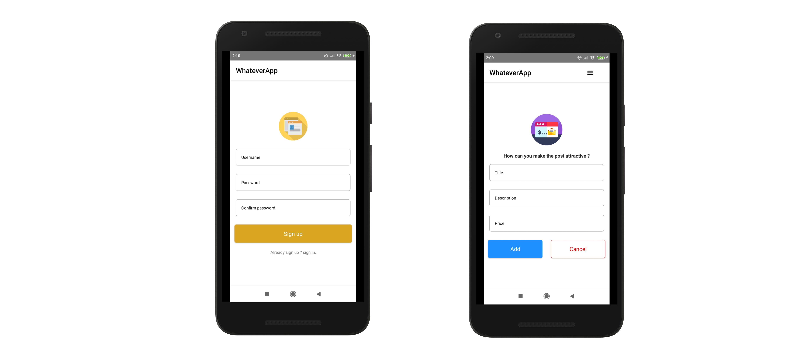

# WhateverApp

![nativescript-url]
![angular-url]



## Short description  
WHATEVERAPP a test app that make it easy to find great deals on the things you want and make money on the things you want to sell.  

## Features

- [x] Buy or sell anything easily.
- [x] Manage your posts
- [x] Having a profil
- [x] Manage user acounts
- [x] No login needed to discover

## Requirements for android os

- Android 4.2+
- VScode

## Installation from the beginning (Windows)

##### WhateverApp
1. First you need to follow these [steps](https://docs.nativescript.org/start/quick-setup)  
2. Then download and install [git](https://git-scm.com/)  
3. Finally run cmd as an administrator, then ```git clone https://github.com/houssemfadhli/whateverapprepo.git```  

```
github "houssemfadhli/whateverapprepo"
```
#### Manually
1. Download and drop ```whateverapprepo``` in any destination you want. 
2. Open the project with VScode
2. Run it!  

## Contact

Houssemfadhliwork@gmail.com  

[Profile](https://github.com/houssemfadhli/)

[nativescript-url]: https://img.shields.io/badge/Nativescript%20%20-%20%20-blue
[angular-url]: https://img.shields.io/badge/Angular-%20%20-red
